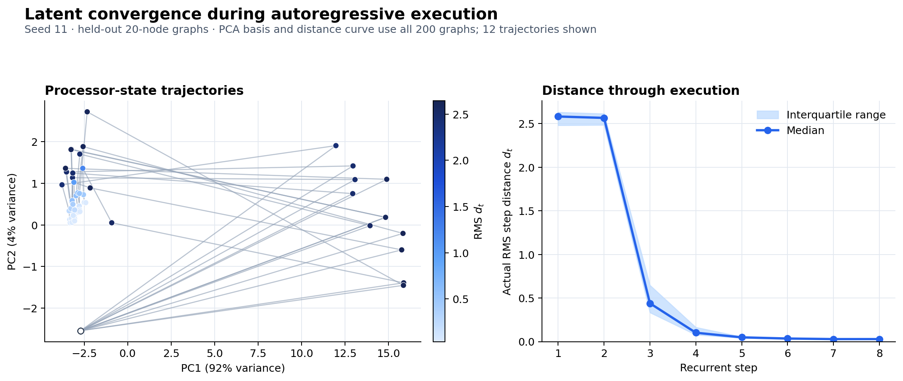

# Structural Termination for Neural Graph Executors

Can a neural algorithm executor determine when to stop from the convergence of
its latent state, without using a separate learned halting head?

## Motivation

Neural algorithm executors usually run for a predetermined number of recurrent
steps or learn an additional module that predicts when to halt. Both approaches
separate termination from the computation itself.

This project tests a structural alternative: as an iterative algorithm
converges, successive processor states should change less. That change may
therefore provide a stopping signal directly from the execution dynamics.

## Method

Let $h_t \in \mathbb{R}^{N \times D}$ be the processor state after recurrent
step $t$. Successive-state change is measured with the root-mean-square
distance

$$
d_t =
\sqrt{
\frac{1}{ND}
\sum_{i=1}^{N}
\sum_{j=1}^{D}
(h_{t,i,j}-h_{t-1,i,j})^2
}.
$$

Execution stops when $d_t < \tau$, where $\tau$ is selected separately for
each algorithm and model seed using validation data only.

The distance is trained with class-balanced termination supervision. The
experiment therefore tests whether termination can be represented directly in
latent geometry and recovered without a separate halting head.

## Results

Five models were trained on 20-node graphs using seeds 11, 22, 33, 44, and 55.
Evaluation is fully autoregressive. Thresholds and fixed-step baselines are
selected on validation data before the test sets are loaded.

| Evaluation | Structural balanced accuracy | Fixed-step balanced accuracy | Structural stop MAE | Structural exact stop |
| --- | ---: | ---: | ---: | ---: |
| Bellman–Ford, 20 nodes | $0.9133 \pm 0.0057$ | $0.7304$ | $0.536 \pm 0.045$ | $0.504 \pm 0.033$ |
| BFS, 20 nodes | $0.9629 \pm 0.0073$ | $0.6398$ | $0.097 \pm 0.035$ | $0.906 \pm 0.032$ |
| Bellman–Ford, 200 nodes | $0.8871 \pm 0.0133$ | $0.6057$ | $1.122 \pm 0.132$ | $0.212 \pm 0.013$ |
| BFS, 200 nodes | $0.6906 \pm 0.0156$ | $0.4085$ | $0.802 \pm 0.079$ | $0.198 \pm 0.079$ |

Values are mean $\pm$ sample standard deviation across model seeds.



The PCA panel illustrates seed 11 trajectories; color represents the actual
RMS distance in the full latent tensor, not distance in the two-dimensional
projection. The distance curve uses all 200 held-out 20-node graphs. The table
contains the five-seed result.

Latent-distance stopping performs strongly for in-distribution BFS and provides
a useful Bellman–Ford termination signal. Performance degrades under the
20-to-200-node size shift.

The complete protocol, per-seed records, aggregate metrics, and provenance are
available in [`results/locked_multiseed/`](results/locked_multiseed/).

## Reproduce

The implementation uses MLX and targets Apple silicon.

```bash
conda env create -f environment.yml
make test
```

Generate the deterministic datasets and verify that no exact graphs overlap
across splits:

```bash
make locked-prepare
```

Run or resume the five-seed experiment, then regenerate the figure:

```bash
make locked
make locked-plot
```

Experiment outputs are written to `results/locked_multiseed/`.
