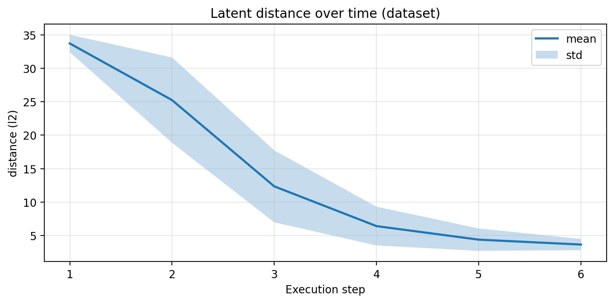

# Structural Termination for Neural Graph Executors

**Can a neural algorithm executor stop when its recurrent latent state converges, without training a separate halting head?**



This repository implements latent-distance stopping for recurrent graph neural
networks that execute classical algorithms. It includes training, evaluation,
threshold sweeps, convergence diagnostics, and a compact historical run for
Bellman–Ford and BFS.

The included results are **preliminary single-seed evidence**, not a finished
accuracy claim. The public artifacts intentionally preserve that boundary.

## Method

Let \(h_t\) denote the processor state after recurrent step \(t\). The structural
signal is the change in state

\[
d_t = D(h_t, h_{t-1}),
\]

where \(D\) can be \(L_1\), \(L_2\), mean nodewise \(L_2\), or mean squared
distance. Execution stops when

\[
d_t < \tau
\]

for a configurable number of consecutive steps. The criterion can operate on
processed states, shared encodings, or algorithm-specific encodings.

## What is currently supported

| Component | Status |
| --- | --- |
| Distance-based stopping | Implemented for processed and encoded latent states |
| Learned-head comparison | Supported by the same evaluator |
| Threshold sweeps | Implemented per algorithm and split |
| Convergence trajectories | Dataset-level and graph-level diagnostics |
| Reproducibility | Resolved configs, seed, environment, Git state, and JSONL metrics |
| Final multi-seed claim | Not yet established |

## Historical diagnostic

The included run used seed `42`, a 32-dimensional processor, two message-passing
layers, and distance-based stopping. At the recorded threshold `7.5`, the saved
evaluation reports:

| Algorithm | Validation accuracy | Test accuracy |
| --- | ---: | ---: |
| Bellman–Ford termination | 92.60% | 80.92% |
| BFS termination | 69.49% | 63.17% |

These are ordinary per-step accuracies from one historical run. They are useful
for reproducing the implementation, but they are not suitable as headline
performance because class balance, seed variance, and a validation-locked
threshold protocol were not established in the artifact.

The saved convergence diagnostic also shows the cohort-averaged successive
\(L_2\) distance declining over execution. The cohort size shrinks at later
steps, so this curve is evidence of a useful signal, not a causal or calibrated
stopping result.

## Reproduce

The MLX implementation targets Apple silicon.

```bash
conda env create -f environment.yml
conda run -n structural-termination python -m src.data.dataset --help
```

Train from a generated dataset:

```bash
conda run -n structural-termination python -m src.train \
  --config configs/termination.yaml
```

Evaluate a checkpoint across thresholds:

```bash
conda run -n structural-termination python -m src.analysis.termination_threshold_sweep \
  --run-dir runs/<run-name> \
  --split val \
  --threshold-min 0 \
  --threshold-max 20 \
  --threshold-step 0.25
```

Inspect latent trajectories:

```bash
conda run -n structural-termination python -m src.analysis.latent_convergence \
  --run-dir runs/<run-name> \
  --split test \
  --latent processed \
  --distance mean_l2
```

Run the checkpoint-independent artifact checks:

```bash
conda run -n structural-termination pytest -q tests/test_published_results.py
```

## Decisive evaluation still required

A publishable stopping claim requires the following locked protocol:

1. Train at least five seeds.
2. Select \(\tau\) on validation data only, then evaluate it once on test data.
3. Report balanced accuracy, AUROC, precision, recall, and absolute stopping-step
   error in addition to ordinary accuracy.
4. Compare against learned-head, fixed-step, and class-prior baselines.
5. Test larger graphs, held-out generator seeds, and randomized node relabelings.
6. Report mean and standard deviation across seeds.

Until that protocol is complete, the defensible claim is:

> Latent-state distance is implemented as a structural stopping signal and shows
> measurable alignment with execution progress in preliminary experiments.

## Repository map

```text
src/model/       recurrent neural graph executor
src/data/        graph generation and algorithm traces
src/utils/       termination rules, evaluation, logging, and checkpoints
src/analysis/    convergence and threshold diagnostics
configs/         reproducible experiment configuration
results/         compact historical evidence with provenance
figures/         selected diagnostics
tests/           consistency checks for public result claims
```

## Limitations

- The bundled run is single-seed and predates the final evaluation protocol.
- Ordinary termination accuracy can be inflated by the nonterminal class prior.
- Raw \(L_2\) distance can vary with graph size; mean nodewise distances and
  size-controlled evaluation are required for cross-size claims.
- The historical validation and test sweeps used different threshold ranges,
  so they must not be interpreted as a locked validation-to-test experiment.
- Checkpoints and generated datasets are excluded because they are large; the
  saved config and result artifacts identify the run exactly.
