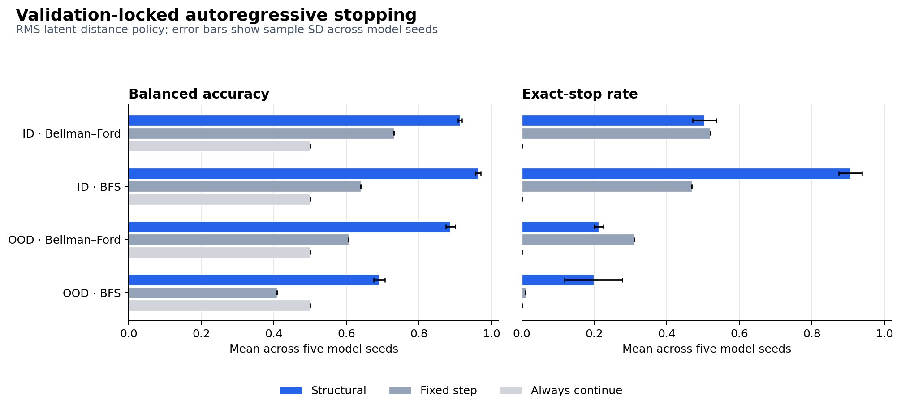

# Structural Termination for Neural Graph Executors

**Can a recurrent neural graph executor use latent-state convergence as a
stopping signal without a separate learned halting head?**

This repository studies that question on Bellman--Ford and BFS executors. The
current result is a validation-locked, five-seed experiment with fully
autoregressive evaluation on 20-node in-distribution graphs and 200-node
size-shifted graphs.

## Result

Let \(h_t \in \mathbb{R}^{N \times D}\) be the processor state after recurrent
step \(t\). The headline structural signal is the size-normalized distance

\[
d_t^{\mathrm{RMS}}
= \sqrt{\frac{1}{ND}\sum_{i=1}^{N}\sum_{j=1}^{D}
  (h_{t,i,j}-h_{t-1,i,j})^2},
\]

and execution predicts termination when \(d_t^{\mathrm{RMS}} < \tau\).
Thresholds and fixed-step baselines are selected independently for each model
seed and algorithm using validation data only.

| Test | Algorithm | Policy | Balanced accuracy | Stop MAE | Exact stop |
| --- | --- | --- | ---: | ---: | ---: |
| ID, 20 nodes | Bellman--Ford | Structural | \(0.9133 \pm 0.0057\) | \(0.536 \pm 0.045\) | \(0.504 \pm 0.033\) |
| ID, 20 nodes | Bellman--Ford | Fixed step | \(0.7304\) | \(0.550\) | \(0.520\) |
| ID, 20 nodes | BFS | Structural | \(0.9629 \pm 0.0073\) | \(0.097 \pm 0.035\) | \(0.906 \pm 0.032\) |
| ID, 20 nodes | BFS | Fixed step | \(0.6398\) | \(0.622\) | \(0.469\) |
| OOD, 200 nodes | Bellman--Ford | Structural | \(0.8871 \pm 0.0133\) | \(1.122 \pm 0.132\) | \(0.212 \pm 0.013\) |
| OOD, 200 nodes | Bellman--Ford | Fixed step | \(0.6057\) | \(1.370\) | \(0.310\) |
| OOD, 200 nodes | BFS | Structural | \(0.6906 \pm 0.0156\) | \(0.802 \pm 0.079\) | \(0.198 \pm 0.079\) |
| OOD, 200 nodes | BFS | Fixed step | \(0.4085\) | \(1.540\) | \(0.010\) |

Values are mean \(\pm\) sample standard deviation across model seeds 11, 22,
33, 44, and 55. The fixed-step values have zero seed variance because that
baseline depends only on the shared validation traces' reference termination
steps. Always-continue has balanced accuracy \(0.5\), stop MAE \(1\), and zero
exact stops by construction.



The result supports supervised latent-distance stopping strongly for ID BFS and
supports a useful ID Bellman--Ford classification signal. Size transfer is
partial for BFS. OOD Bellman--Ford classification remains strong, but its mean
signed stop error is \(-1.122\) steps: it stops early and does not establish
usable autonomous halting.

Raw accuracy is deliberately not a headline metric. On OOD Bellman--Ford,
always-continue reaches \(0.8325\) raw accuracy while the structural policy
reaches \(0.8121\), even though always-continue never detects termination.

## What the result does and does not show

The latent distance is **supervised**. Training includes a class-balanced binary
termination loss applied to the distance signal with weight \(1.0\). The
experiment therefore shows that termination information can be encoded in
latent geometry and recovered without a separate learned halting head at
inference. It does not show that convergence emerges without termination
supervision.

The current evidence is partially supportive, not a universal halting result:

- strong ID timing is established for BFS;
- size-generalizing timing degrades substantially at 200 nodes;
- graph-family, relabeling, and multiple-size holdouts are not yet evaluated;
- a matched learned-head baseline and a no-termination-supervision ablation are
  still missing;
- algorithm-output correctness at the predicted stop is not yet measured;
- the five seeds share the same test graphs, so the reported spread measures
  model-seed variability rather than dataset-sampling uncertainty.

RMS is used for the headline table because it performed better across the
reported test comparisons. The experiment also retains mean-nodewise \(L_2\)
results, but the protocol did not pre-register a rule for choosing the headline
distance family. Both are available in the result records.

## Locked protocol

All thresholds and fixed steps are selected on validation data before the ID
and OOD test files are loaded. Training uses recurrent teacher forcing; locked
validation and test trajectories are fully autoregressive.

| Split | Graphs | Nodes | Generator seed | Use |
| --- | ---: | ---: | ---: | --- |
| Train | 1,500 | 20 | 1101 | Parameter fitting |
| Validation | 200 | 20 | 2202 | Threshold and fixed-step selection |
| Test ID | 200 | 20 | 3303 | Untouched in-distribution test |
| Test OOD | 100 | 200 | 4404 | Untouched size-shift test |

Exact graph overlap is zero across every split pair. Each seed trains for 100
epochs, corresponding to 150,000 sampled training-graph presentations.

For each algorithm and distance, validation selects the threshold that
maximizes balanced accuracy, with ties broken by stopping MAE and then the
smaller threshold. The fixed-step baseline minimizes validation stopping MAE,
with ties broken by balanced accuracy and then the earlier step. An absent stop
is scored as one step beyond the reference horizon.

The complete metric set includes accuracy, balanced accuracy, precision,
recall, specificity, F1, signed and absolute stopping-step error, exact-stop
rate, early-stop rate, and late-or-missing-stop rate.

## Inspect and reproduce

The compact evidence bundle is committed under
[`results/locked_multiseed/`](results/locked_multiseed/):

- `protocol_manifest.json` freezes splits, seeds, supervision, selection rules,
  rollout mode, dataset hashes, and overlap checks;
- `seeds/seed_*/locked_results.json` records every validation selection and test
  result;
- `aggregate.json` contains the five-seed means and sample standard deviations.

Automated tests independently re-aggregate the headline metrics from all five
seed records and enforce the protocol contract.

The implementation targets Apple silicon because it uses MLX:

```bash
conda env create -f environment.yml
make test
make locked-prepare
make locked
make locked-plot
```

`make locked-prepare` deterministically generates the four datasets, checks all
pairwise exact graph overlaps, and writes their SHA-256 hashes. `make locked`
trains or resumes the five seeds and evaluates the frozen protocol. Generated
datasets, checkpoints, and machine-local logs are excluded from Git.

## Provenance

The result records were produced from commit `b8f8a8d` with a dirty tracked
working tree. The recorded dirty-diff hash did not cover untracked source files,
so the exact original training tree cannot be reconstructed from Git alone.
During an independent audit, the published source regenerated seed 11's entire
`locked_results.json` exactly from its retained checkpoint. This verifies that
evaluation path, but it does not retroactively establish clean-source training
provenance for all five seeds. A clean rerun remains required to close that gap.

## Historical reference artifact

The repository also preserves a hashed step-500 checkpoint and two datasets
from an earlier single-checkpoint study. Its teacher-forced metrics and figures
can be regenerated with:

```bash
make reproduce
```

This command verifies SHA-256 hashes, strictly reloads the checkpoint,
regenerates the evaluation and analyses, and compares all values with
`results/reference/expected.json`. The historical result is useful as a
reproduction fixture, not as autonomous-halting or multi-seed evidence.

Run a tiny deterministic end-to-end generation, training, checkpoint reload,
evaluation, threshold sweep, and plotting workflow with:

```bash
make smoke
```

## Repository map

```text
artifacts/reference/            hashed historical checkpoint and datasets
configs/                        reference, smoke, baseline, and locked configs
figures/                        locked summary and historical diagnostics
results/locked_multiseed/       frozen protocol and compact five-seed evidence
results/reference/              historical reference outputs
src/analysis/                   locked evaluation and analysis entry points
src/data/                       deterministic graph generation and dataset I/O
src/model/                      recurrent neural graph executor
src/reproduce.py                reference and smoke reproduction entry point
tests/                          provenance, metric, and workflow checks
```
